# Bluetooth NES Advantage
Integrated Bluetooth adapter for the NES Advantage (NES-026)

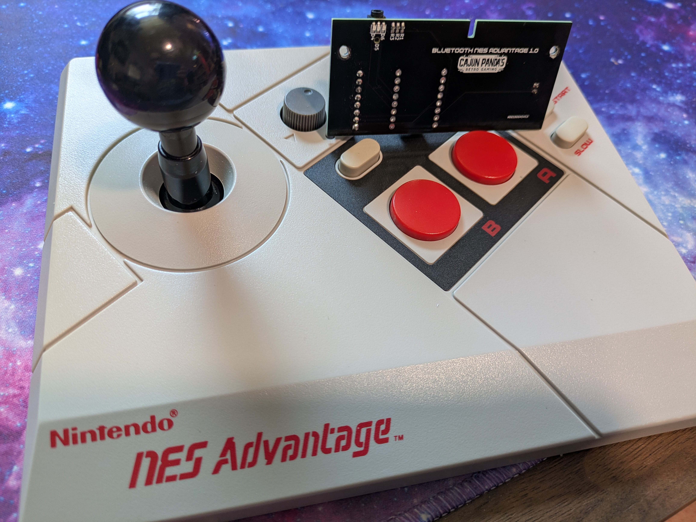

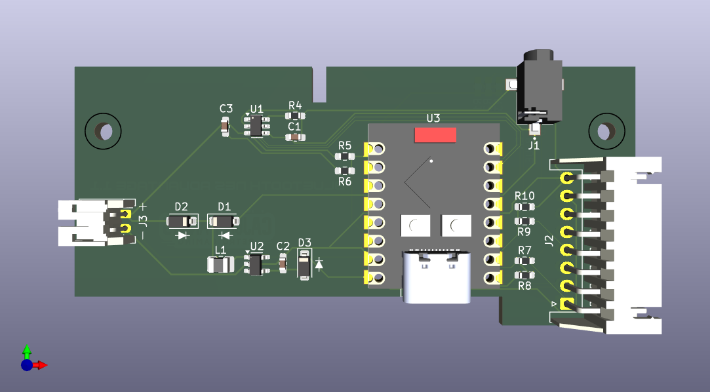

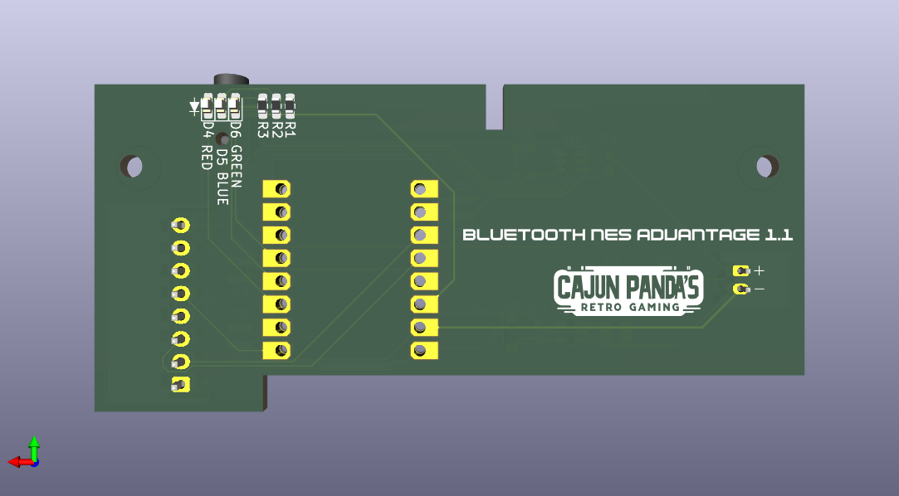

## Where to buy
Buy a completed kit ready to drop into your NES Advantage here:

[Tindie](https://www.tindie.com/products/cajunpanda/bluetooth-nes-advantage-kit/)

[Ko-Fi](https://ko-fi.com/s/c1f66f6bd5)

## Overview
The BT-NES-Advantage is a custom Bluetooth adapter built into the NES Advantage controller, allowing it to connect wirelessly to modern devices as a standard Bluetooth gamepad. This project uses an ESP32-C3 microcontroller to read the NES controller's inputs and transmit them via Bluetooth HID protocol.

## Features
- Wireless Bluetooth LE connectivity
- Turbo and slow motion functions work as normal
- Player select switch
   - Exposes two game input devices for player 1 and 2. The player select switch redirects output to one or the other.
- Standard gamepad HID implementation, tested with:
   - BlueRetro (only works with player 1 switch)
   - Windows
   - Android
   - SteamOS
   - Linux
- *This mod does not work with the 8BitDo Retro Receiver, it doesn't support BLE*
- Long battery life with low power sleep mode
- RGB status LED indication
- Battery level monitoring and reporting
- 5V DC barrel jack charging port

## Usage Instructions

### Pairing the Controller
1. **Turn on the controller** - The controller will automatically wake up when the Start button is held.
2. **Enter pairing mode** - The controller will automatically enter pairing mode when turned on, indicated by a blinking blue LED.
3. **Pair with your device** - On your device (computer, smartphone, game console, etc.), go to Bluetooth settings and select "NES Advantage" from the list of available devices.
4. **Connection successful** - When successfully connected, the blue LED will turn solid.

### Button Mapping
The NES Advantage controller buttons are mapped to standard gamepad controls:
- **D-Pad** - Maps to the directional pad or left analog stick (configurable)
- **A button** - Maps to Button 1 (default profile) or Button 1 (Blue Retro profile)
- **B button** - Maps to Button 2 (default profile) or Button 4 (Blue Retro profile)
- **Start button** - Maps to Start button (Button 12)
- **Select button** - Maps to Select button (Button 11)

#### Button Mapping Profiles
The controller supports multiple button mapping profiles:
1. **Default Profile** - A=Button 1, B=Button 2, Select=Button 11, Start=Button 12
2. **Blue Retro Profile** - A=Button 1, B=Button 4, Select=Button 11, Start=Button 12

To change profiles, hold **A + B + Up** for 5 seconds. The red LED will blink to indicate the current profile (1 blink = Profile 1, 2 blinks = Profile 2).

#### Directional Input Modes
The controller supports three directional input modes:
1. **D-Pad Only** - Directional input sent only to the D-pad/hat switch
2. **Axes Only** - Directional input sent only to the analog stick axes
3. **Both** - Directional input sent to both D-pad and analog stick axes

To change directional modes, hold **Down + A + B** for 5 seconds. The red LED will blink to indicate the current mode (1 blink = D-Pad Only, 2 blinks = Axes Only, 3 blinks = Both).

### Special Functions
- **Sleep mode** - To manually put the controller into sleep mode, hold the **Start button** for 5 seconds. The LEDs will turn off when the controller enters sleep mode.
- **Reconnect/Pair new device** - To disconnect from the current device and enter pairing mode again, hold the **Select button** for 5 seconds.
- **Wake from sleep** - Hold the **Start button** to wake the controller from sleep mode.
- **Change button mapping profile** - Hold **A + B + Up** for 5 seconds to cycle through available button mapping profiles. The red LED will blink to indicate the current profile number.
- **Change directional pad mode** - Hold **Down + A + B** for 5 seconds to cycle through directional input modes (D-Pad Only, Axes Only, Both). The red LED will blink to indicate the current mode.

### LED Indicators
- **Blue LED**:
  - Solid ON - Connected to a device
  - Blinking - In pairing mode (advertising)
  - OFF - Not connected or in sleep mode
- **Green LED**:
  - Blinking - Battery charging
  - Solid ON - Battery fully charged
  - OFF - Not charging
- **Red LED**:
  - Blinking - Low battery (below 20%)
  - OFF - Battery level normal

### Battery and Power
- The controller uses a rechargeable LiPo battery.
- To charge, connect a 5V DC power adapter to the barrel jack.
- Battery level is reported to the connected device when supported.
- The controller will automatically enter sleep mode after 5 minutes of inactivity to conserve power.
- When advertising (pairing mode), the controller will stop advertising after 30 seconds to save battery.

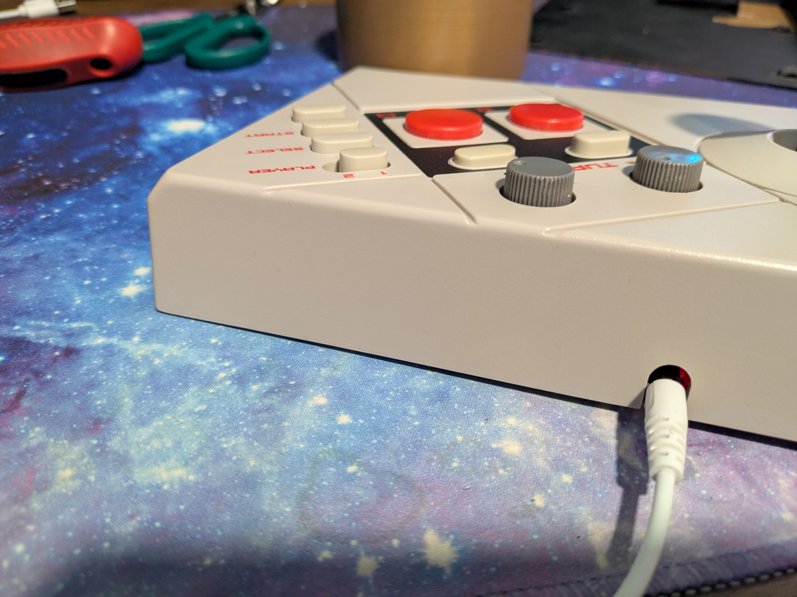
*NES Advantage controller charging via 5V DC barrel jack*

### 3D Printable DC Jack Plug

For a clean installation, a custom 3D printable DC jack plug is available that fits perfectly in the NES Advantage case:

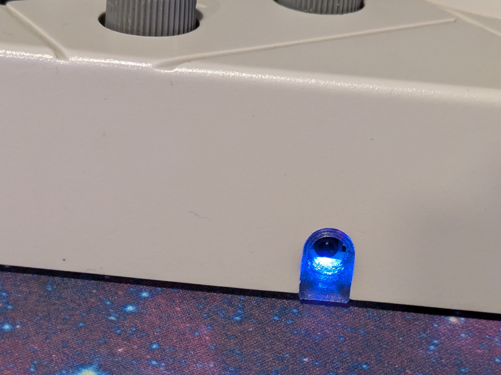
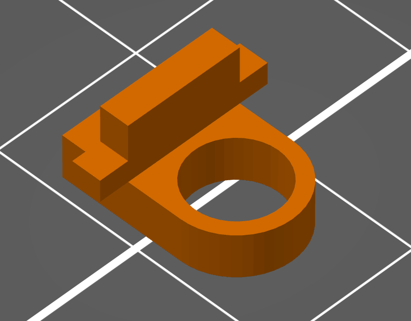

**Download STL file**: [bt_nes_advantage-jack_plug.stl](models/bt_nes_advantage-jack_plug.stl)

Print with a transparent PLA in order to see the status LEDs.

### Troubleshooting
- If unable to pair with a new device, ensure the controller is in pairing mode (blue LED blinking).

## Technical Specifications
- MCU: ESP32-C3 (LOLIN C3 Mini)
- Bluetooth: BLE 5.0
- Battery: 3.7V LiPo 
- Charging: Via 5V DC barrel jack
- Power consumption: ~120mA when connected, <1mA in sleep mode
- Original NES controller compatibility: 100% hardware compatible

## PCB Assembly Instructions
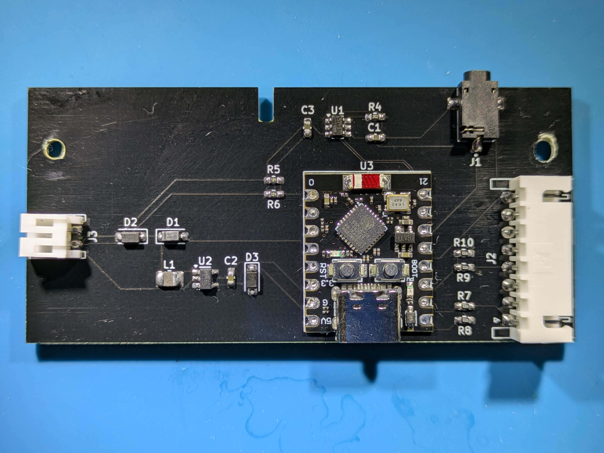
### Bill of Materials (BOM)

| Designator | Qty | Value | Footprint | Description | Notes |
|------------|-----|-------|-----------|-------------|-------|
| C1, C3 | 2 | 10µF | C_0603_1608Metric | Unpolarized capacitor | SMT |
| C2 | 1 | 22µF | C_0603_1608Metric | Unpolarized capacitor | SMT |
| D1, D2, D3 | 3 | 1N5817W | D_SOD-123 | Schottky diode | SMT |
| D4, D5, D6 | 3 | LED | LED_0603_1608Metric | RGB LED (R,G,B) | SMT, 1=K 2=A |
| J1 | 1 | PJ-043-SMT-TR | CUI_PJ-040-SMT-TR | DC Power Jack | SMT, 5V input |
| J2 | 1 | Conn_01x08_Socket | JST_XH_S8B-XH-A_1x08_P2.50mm | 8-pin NES controller connector | Horizontal, THT |
| J3 | 1 | JST Connector | JST_PH_S2B-PH-K_1x02_P2.00mm | LiPo battery connector | Horizontal, THT |
| L1 | 1 | 2.2µH | L_1008_2520Metric | Inductor | SMT |
| R1, R2, R3 | 3 | 200Ω | R_0603_1608Metric | Resistor for LEDs | SMT |
| R7, R8, R9, R10 | 4 | 1KΩ | R_0603_1608Metric | Resistor | SMT |
| R4 | 1 | 2KΩ | R_0603_1608Metric | Resistor | SMT |
| R5, R6 | 2 | 100KΩ | R_0603_1608Metric | Voltage divider for battery monitoring | SMT |
| U1 | 1 | TP4057 | TSOT-23-6 | Li-ion battery charger IC | SMT |
| U2 | 1 | TPS613222ADBV | SOT-23-5 | 5V boost converter | SMT |
| U3 | 1 | ESP32-C3_SUPERMINI_TH | ESP32-C3 SuperMini | ESP32-C3 WiFi/BLE module | THT |

### Parts Sourcing

- **PCB**: [PCBWay Project - Order PCB](https://www.pcbway.com/project/shareproject/Bluetooth_NES_Advantage_865d24ef.html)
- **Parts List**: [Digikey Parts List](https://www.digikey.com/en/mylists/list/EVZPX74W7P)
- **ESP32-C3 SuperMini Module**: [Amazon Link](https://a.co/d/1LoWyFs)
- **J2 Connector Harness Cable**: [Amazon Link](https://a.co/d/abYfjqw)
- **Recommended Battery**: [103450 3.7V LiPo Battery](https://a.co/d/7UFYwX9) (IMPORTANT: Check polarity before connecting)
- **Charging cable**: [DC 2.5x0.7mm Barrel Jack Power Cable](https://a.co/d/4bPUQj2)

### Schematic
[Link to PDF](docs/schematic.pdf)

### Gerber
[Link to Gerber files](pcb/bt-nes-advantage.kicad_pcb.zip)

### Assembly Steps
1. **PCB Preparation**
   - Ensure you have the latest PCB design files from the `pcb` directory
   - Verify that all components from the BOM are available before starting

2. **Component Placement Order**
   - Start with SMD components in this order:
     1. Resistors (R1-R10)
     2. Capacitors (C1-C3)
     3. Diodes (D1-D3)
     4. LEDs (D4-D6) - Note the polarity! Cathode (K) is marked
     5. ICs (U1, U2)
     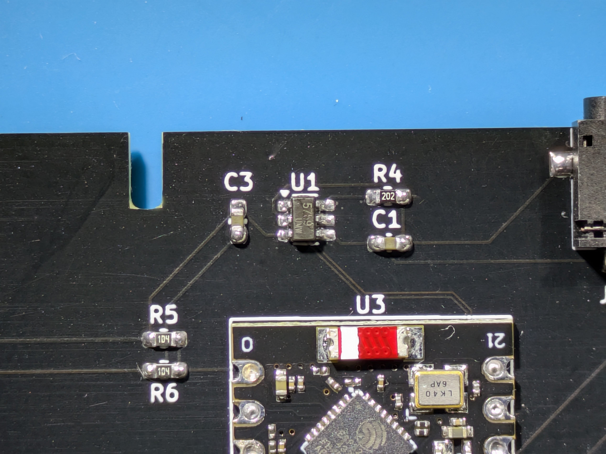
*TP4057 U1 pin 1 may not be marked, make sure to get the orientation right by referencing this image and the datasheet.*
     6. Inductor (L1)
     7. DC Jack (J1)
   - Then place through-hole components:
     1. JST connectors (J2, J3)
     2. ESP32-C3 module (U3)

3. **Soldering Guidelines**
   - For SMD components:
     - Use a fine-tip soldering iron (0.5mm or smaller)
     - Recommended temperature: 320-350°C
     - Apply small amount of flux for better results
     - Use tweezers for precise placement
   - For THT components:
     - Secure components flush to PCB before soldering
     - Solder from the lowest-profile components to the highest

4. **Power Connections**
   - The battery connector (J3) is for a 3.7V LiPo battery
     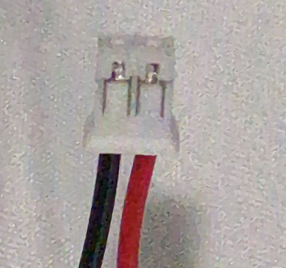
*Check your battery polarity! There isn't a standard and it may be swapped from what is required!*   
   - Use appropriate JST PH connector with correct polarity
   - The power jack (J1) accepts 5V DC input

5. **Controller Connections**
   - Connect the PCB to the NES Advantage controller using the 8-pin JST XH connector (J2)
   - Pinout from left to right: DATA_P1, LATCH, CLK_P1, DATA_P2, CLK_P2, N/C, +5V, GND
    6. **Pin Mapping**
        - Refer to this pin mapping diagram for connecting the PCB to the NES Advantage controller:
        
        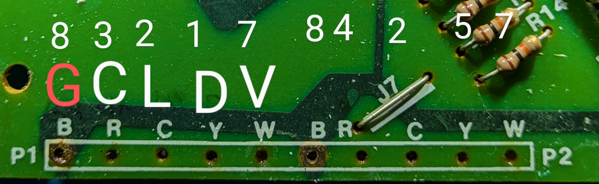
        
7. **Installation in Controller**
    - Carefully open the NES Advantage controller by removing the screws from the bottom. Refer to this video for a full teardown:
    
    [](https://youtu.be/Sw1IDFrGwic?si=m9LdfxoDmvacOw2x)

    - Install the battery in the recommended position:
    
    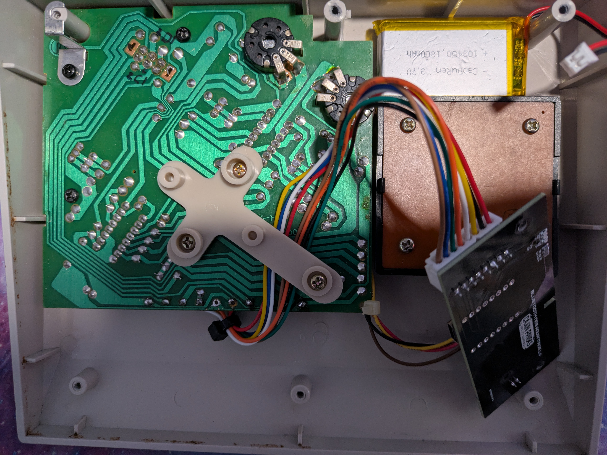
    
    - Place the PCB in the controller as shown below:
    
    
    
    - Route wires to avoid interference with moving parts of the joystick

    - Finally add some insulating tape to the metal back cover to avoid accidental shorting when reassembling.
    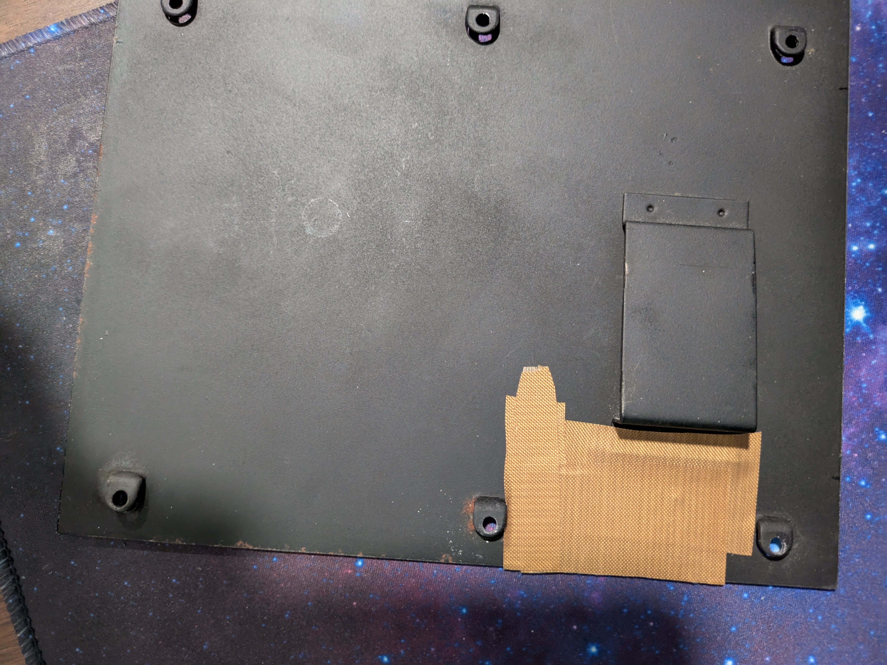

## Firmware Instructions

### Option 1: Using Prebuilt Firmware (Recommended)

1. **Download the Firmware**
   - Go to the [Releases page](https://github.com/aaronperkins/bt-nes-advantage/releases) on GitHub
   - Download the latest firmware release

2. **Install ESP Flash Tool**
   - For Linux/Mac: Install `esptool` via pip:
     ```bash
     pip install esptool
     ```
   - For Windows: Download the [ESP Flash Download Tool](https://www.espressif.com/en/support/download/other-tools) from Espressif

3. **Connect the ESP32-C3 SuperMini**
   - Connect the ESP32-C3 SuperMini module to your computer via USB
   - Put the device in download mode by holding the BOOT button while connecting

4. **Flash the Firmware**
   
   #### Option A: Single Merged Binary (Easiest)
   If a merged binary file (`bt_nes_advantage_lolin_c3_mini.bin`) is available:
   ```bash
   esptool.py --chip esp32c3 write_flash 0x0 bt_nes_advantage_lolin_c3_mini.bin
   ```
   
   #### Option B: Individual Binary Files
   If using separate `bootloader.bin`, `partitions.bin`, and `firmware.bin` files:
   - For Linux/Mac (using esptool):
     ```bash
     esptool.py --chip esp32c3 write_flash 0x0000 bootloader.bin 0x8000 partitions.bin 0x10000 firmware.bin
     ```
   - For Windows (using ESP Flash Download Tool):
     - Select Chip Type: ESP32-C3
     - Select bootloader.bin at address 0x0000
     - Select partitions.bin at address 0x8000
     - Select firmware.bin at address 0x10000
     - Select the correct COM port
     - Click "START" to begin flashing

5. **Verify Installation**
   - After flashing completes, press the RST button or disconnect and reconnect the device
   - The blue LED should start blinking indicating pairing mode

### Option 2: Building and Uploading from Source

#### Prerequisites
- VSCode
- PlatformIO VSCode extention
- USB cable for connecting to the ESP32-C3 SuperMini module

#### Building the Firmware with PlatformIO

1. **Install PlatformIO**
   - Install PlatformIO as an extension for VSCode

2. **Clone the Repository**
   ```bash
   git clone https://github.com/aaronperkins/bt-nes-advantage.git
   cd bt-nes-advantage
   ```

3. **Open the Project in PlatformIO**
   - In VSCode with PlatformIO extension, select "Open Project" and choose the `firmware` folder
   

4. **Configure the Project**
   - The `platformio.ini` file is already configured with the correct settings

5. **Build the Project**
   - In PlatformIO IDE, click on the "Build" button

6. **Connect the ESP32-C3 SuperMini**
   - Connect the ESP32-C3 SuperMini module to your computer via USB
   - If you've already installed it in the controller, you'll need to either:
     - Connect to the USB port on the module

7. **Upload the Firmware**
   - In PlatformIO IDE, click on the "Upload" button

8. **Create Distribution Files (Optional)**
   - If using VS Code with the included tasks, you can create merged firmware files for distribution:
     - Press `Ctrl+Shift+P` and select "Tasks: Run Task"
     - Choose "Full Release Build" to create optimized firmware with merged binary
     - Or choose "Build and Upload Release" to build and upload in one step
     - Distribution files will be created in the `dist/` folder

9. **Monitor Serial Output (Optional)**
   - For debugging, you can monitor the serial output at 115200 baud
   - In PlatformIO IDE, click on the "Serial Monitor" button

